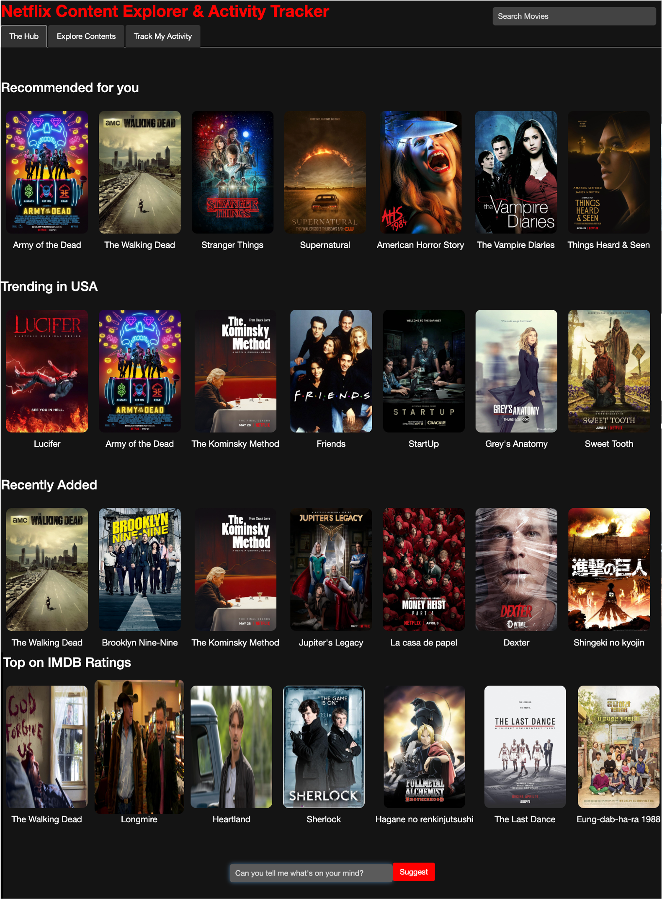
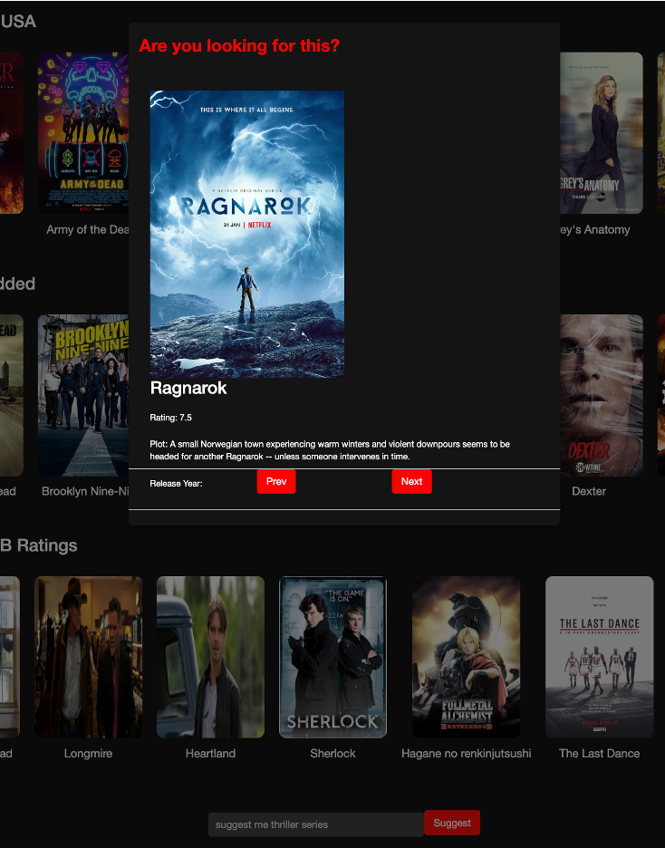
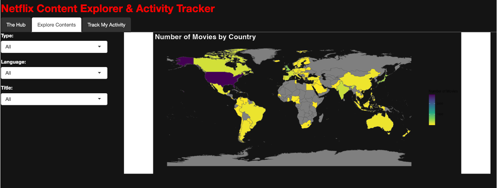
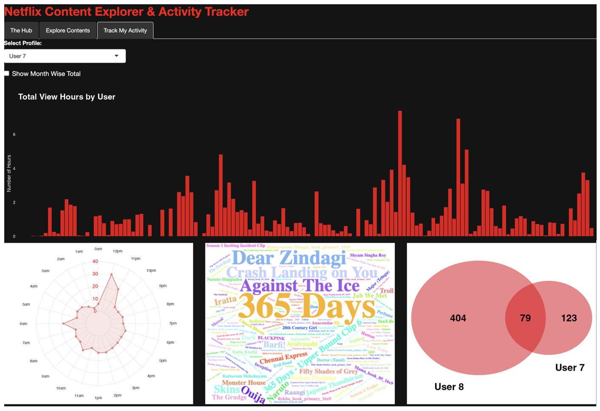

# Netflix like Content Explorer & Activity Tracker

An interactive **R Shiny** application to explore the Netflix content library, receive personalized recommendations, and analyze user viewing activity.  
The project demonstrates modular Shiny development, reusable services, and interactive visualizations.

---

## Features

### 1. The Hub
- Search bar to quickly find titles.
- Horizontal content rails:
  - Recommended for You
  - Trending in USA
  - Recently Added
  - Top on IMDB Ratings
- Open search modal to suggest content by keyword (genre, country, language).

### 2. Explore Contents
- Sidebar filters: **Type**, **Language**, **Title**.
- Choropleth world map:
  - *All Titles*: density by country of origin.
  - *Single Title*: highlight origin country.
- Dynamic movie/show card with poster, cast, runtime, plot, and IMDB rating.

### 3. Track My Activity
- Analyze viewing history by **day** or **month**.
- Radar chart for average viewing by hour of day.
- Wordcloud of most-watched shows.
- Venn diagram to compare two users’ viewing overlaps.

---

## Data Sources

- **Netflix Movies & TV Shows Dataset (June 2021)**  
  - Public Kaggle dataset, scraped from IMDb.  
  - ~7000 titles with details like title, type, genres, cast, runtime, plot, ratings, country, language.

- **Netflix Watch Log Dataset**  
  - Public Kaggle dataset with viewing history of multiple users.  
  - Used for activity tracking and analysis.

*Note: Large raw datasets are excluded from this repo. Place sample data in `data/`.*

---

## Screenshots

### The Hub


### Movie Card


### Global Analysis


### Activity Analysis


---
## Setup Instructions

### 1. Clone the repository
```bash
git clone https://github.com/<your-username>/netflix-explorer.git
cd netflix-explorer
```

### 2. Initialize R environment

Open R or RStudio and run:
```R
install.packages("renv")
renv::restore()  # installs all dependencies listed in renv.lock
```

### 3. Run the app
```R
shiny::runApp(".")
```

## Development Notes

- Modularized: Each tab (Hub, Explore, Activity) has its own mod_*.R file.
- Data Service: svc_data.R ensures a single source of truth for datasets.
- Visualization Helpers: Radar charts, choropleths, Venn diagrams built via dedicated helpers.
- Styling: Netflix-inspired theme in www/styles.css.

## Contributing

1. Create a new branch from main:

2. git checkout -b feature/my-improvement

3. Make your changes.

4. Commit and push:
```bash
git add -A
git commit -m "feat: describe your change"
git push origin feature/my-improvement
```

5. Open a Pull Request (PR) on GitHub.
